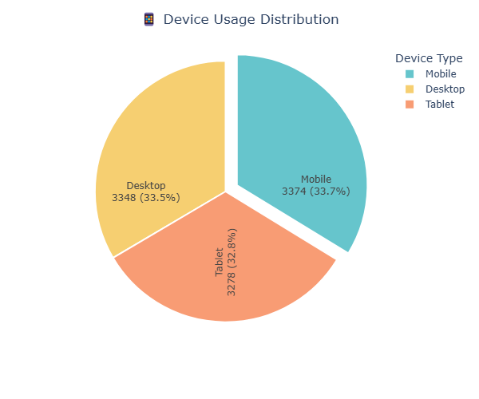
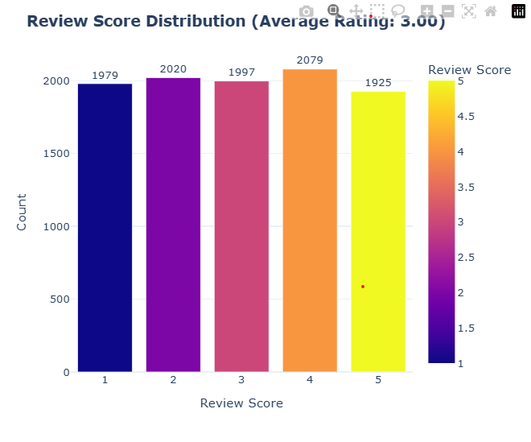

# 📊 E-Commerce Customer Behavior Analysis

## 📌 Project Overview
This project analyzes customer behavior for an e-commerce platform, focusing on purchase patterns, device usage, satisfaction levels, and regional trends.  
The goal is to provide actionable business insights to improve sales, retention, and customer experience.

## 🎯 Key Insights
- **Average Review Score:** 3.0 (neutral satisfaction)
- **Repeat Customers:** 43.4%
- **Most Used Device:** Mobile (~34%)
- **Top Product Categories:** Electronics, Clothing, Toys
- **High-Value Region:** Barisal (2nd highest avg. purchase amount)
- **Behavioral Insight:** Time spent on site doesn’t predict purchase volume

## 📈 Business Recommendations
- Focus on **mobile-first** optimization  
- Use **personalized product recommendations** to boost sales  
- Improve **logistics** in slower delivery regions like Rajshahi  
- Launch **targeted campaigns** in high-value regions  

## 🛠️ Tools & Libraries
- Python (Pandas, NumPy, Matplotlib, Seaborn, Plotly)
- Jupyter Notebook
- Data Visualization

## 📂 Repository Structure
```
E-Commerce-Customer-Behavior-Analysis/
│
├── data/ # Dataset
├── notebooks/ # Analysis notebook
├── images/ # Visualization images
├── presentation/ # Final presentation
├── README.md # Project documentation
└── requirements.txt # List of dependencies
```

## 📊 Sample Visualizations



## 🚀 How to Run
1. Clone the repository:
   ```bash
   git clone https://github.com/<your-username>/E-Commerce-Customer-Behavior-Analysis.git
   
2. Install dependencies:
   pip install -r requirements.txt

3. Open the notebook:
   jupyter notebook Final_Assignment.ipynb
   
📜 License
This project is for educational purposes only.


